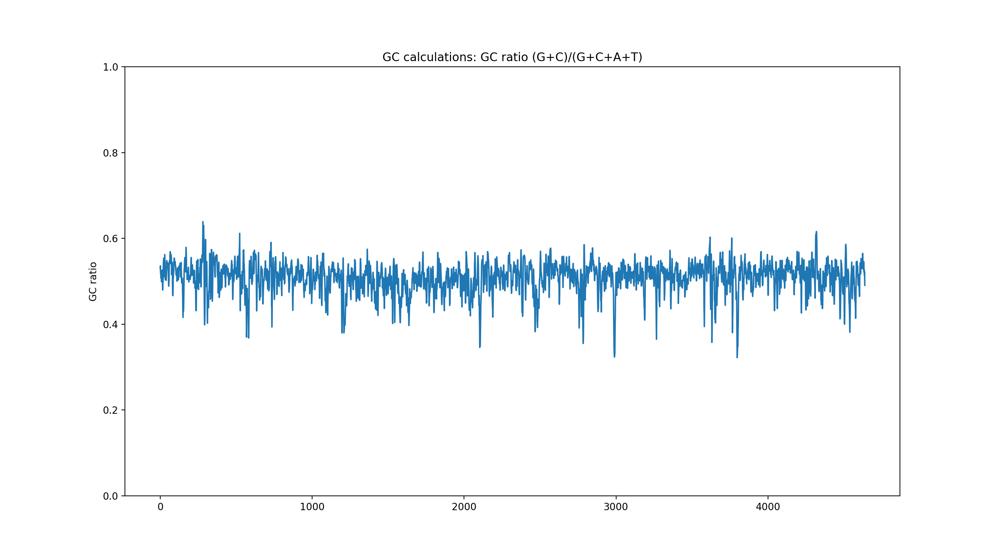

# GP_GC
Sequence GC ratios and skew calculations.

# Example
```bash
# GC ratio from NCBI sequence ID
./gc.py U00096.3 --func=gc_ratio --window=4000 --step=1000

# GC ratio from file
./gc.py demo/U00096.3.fasta --func=gc_ratio --window=4000 --step=1000

# GC skew
./gc.py demo/U00096.3.fasta --func=gc_skew --window=4000 --step=1000
```

<html>
<body>
    <div>
        <h4>GC ratio</h4>
        <p>
            
        </p>
        <h4>GC skew</h4>
        <p>
            
        </p>
    </div>
</body>
</html>